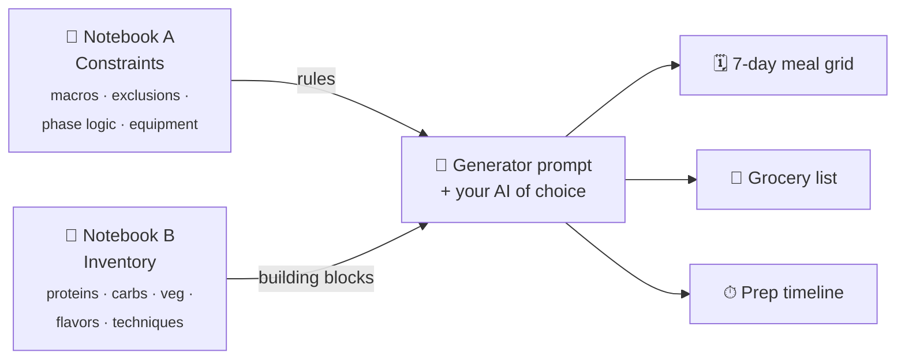

<!--
  Logo placeholder — drop a 96–128px image here when ready.
  <p align="center">
    
  </p>
-->

<h1 align="center">Meal Monster</h1>

<p align="center">
  <strong>A prompt-driven meal-planning framework that turns your macros, exclusions, and ingredient library into a weekly plan, grocery list, and prep timeline.</strong>
  <br/>
  <em>Pair it with any capable AI. Keep your data wherever you want.</em>
</p>

<p align="center">
  <a href="LICENSE"></a>
  <a href="prompts/setup-interview-prompt.md"></a>
  <a href="#-what-youll-need"></a>
  <a href="#-where-to-store-your-reference-documents"></a>
  <a href="SECURITY.md"></a>
</p>

<p align="center">
  <a href="#-what-youll-need">What you'll need</a> ·
  <a href="#-how-it-works">How it works</a> ·
  <a href="#-quick-start">Quick start</a> ·
  <a href="#-where-to-store-your-reference-documents">Storage</a> ·
  <a href="#-worked-example">Example</a> ·
  <a href="#-faq">FAQ</a> ·
  <a href="#-disclaimer">Disclaimer</a>
</p>

---

Most meal planners hand you somebody else's recipes and hope your goals fit. **Meal Monster inverts that.** It's a framework you fill in, not a database you browse — built for people running a structured cut, recomp, or lean-bulk who already know their macros, train seriously, and want every meal to enforce things like a per-meal protein floor, a leucine threshold, carbs front-loaded around training, and a caffeine ceiling **you** define.

The framework ships as a small set of prompts and a template document. An AI of your choice runs them. The output is a weekly meal plan, a consolidated grocery list, and a parallel-appliance prep-day timeline — produced in roughly thirty seconds, every week, against the same rules you set on day one.

---

## 🎯 What you'll need

Meal Monster is the framework; an AI is what runs it. You'll need:

| What | Why |
|---|---|
| **An AI you trust to read text and follow instructions** | Anything frontier-class works — Claude Code, Codex, ChatGPT, Claude in a Project, Gemini, etc. The prompts assume nothing model-specific. |
| **Somewhere to keep your reference documents** | A folder of markdown files, a Claude Project, a NotebookLM notebook, or anywhere else your AI can read. See [Where to store](#-where-to-store-your-reference-documents). |
| **About 20 minutes** for the one-shot setup interview | The [setup prompt](prompts/setup-interview-prompt.md) interviews you and produces a populated Notebook A you can use forever. |

---

## 🧩 How it works



**Notebook A** is the rules engine — your profile, macros, exclusions, supplement stack, equipment, and phase logic (ramp-in, aggressive cut, diet break, stall triggers). You populate it once and update it rarely.

**Notebook B** is your living ingredient and technique library. It grows over time as you feed sources you trust — recipes, articles, cookbooks, transcripts, your own notes — through a structured ingestion prompt that sorts everything into six inventories: proteins, carbs, volume vegetables, flavor stacks, bulk-cook techniques, and meal templates.

**The generator prompt** reads both reference documents weekly. It quotes your rules back verbatim before producing any meal content (so drift surfaces immediately), then emits the artifact: a 7-day meal grid, daily totals with caffeine flags, a grocery list grouped by store section, and a prep-day timeline that schedules parallel appliance tracks while reconciling cooked-gram yield against the week's plan.

> 💡 **"Notebook" is just our shorthand for "a reference document your AI can read."** The naming convention comes from NotebookLM, where this framework was first built — but Meal Monster doesn't require NotebookLM. Both notebooks can live wherever you want.

---

## ✨ Features

|  |  |
|---|---|
| **🎯 Constraints as data** | Every hard rule lives in Notebook A as structured prose. The generator quotes it back verbatim before producing any meal content — drift surfaces immediately. |
| **📚 Inventory-grounded** | The generator never invents ingredients or techniques. Every protein, carb, veg, and bulk-cook method must trace to an entry in Notebook B. |
| **✅ Explicit quality gates** | The agent emits `PLAN_OK` / `PREP_OK` self-check blocks. A fail returns with revision deltas instead of silent edits. |
| **🍳 Equipment-aware prep** | The prep timeline assumes parallel appliance tracks and reconciles cooked-gram yield against the week's plan. |
| **📈 Phase logic is first-class** | Ramp-in, aggressive cut, diet break, and phase advance / hold triggers are encoded in Notebook A — the agent enforces them rather than rediscovering them weekly. |
| **🛡 You set the safety thresholds** | Caffeine ceiling, fat floor, fiber floor, and other safety-adjacent numbers are user-defined placeholders, not hardcoded values. |

---

## 🚀 Single-prompt setup

The hardest part of any framework is filling it in. Meal Monster ships with **one setup prompt** — [`prompts/setup-interview-prompt.md`](prompts/setup-interview-prompt.md) — that you drop into your AI of choice. It will:

- **Open with a disclaimer** (not medical advice, recreational use, privacy reminder).
- **Interview you conversationally**, in small batches of 2–4 questions at a time.
- **Offer to research on your behalf** — macro calculation from body weight + goal, caffeine content of named supplements, technique substitutions for missing equipment, default fat / fiber floors with citations, sensible cut-and-diet-break schedules.
- **Push back when something looks off** — protein anchored to current weight at very high body weight, a fat target that compromises hormones, an unsustainable deficit, etc.
- **Output a fully populated `notebook-a-framework.md`** you can save into your chosen reference store.
- **Suggest seed sources for Notebook B** so your first weekly plan is one ingestion away.

If you'd rather fill the template by hand, the placeholders in `notebook-a-framework.md` are all yours to define — but the interview is faster and catches mistakes.

---

## 🗂 Where to store your reference documents

Pick whichever fits how you already work — Meal Monster doesn't care:

| Option | Best for | How it works |
|---|---|---|
| **Local markdown files** | You already use a file-aware AI (Claude Code, Codex, Aider, Cursor). Simplest possible setup. | Save `notebook-a-framework.md` and a `notebook-b.md` (or a folder) in a directory. Your tool reads them directly. |
| **Claude Project or Custom GPT** | You want persistent context in a dedicated chat thread, no file-aware tool required. | Upload both files once. The model has them in every conversation in that project. |
| **NotebookLM** | Notebook B is growing past a dozen sources and you want RAG-style queries across all of them. | Create two notebooks; upload Notebook A as a single source; ingest Notebook B sources via the ingestion prompt. Pair with Gemini or any AI that can talk to NotebookLM. |

You can mix-and-match (e.g., local Notebook A + NotebookLM for Notebook B) or move between options as your setup evolves. The prompts work the same way regardless.

---

## ⚙️ Quick start

1. **Fork this repo.**
2. **Run the setup interview.** Paste [`prompts/setup-interview-prompt.md`](prompts/setup-interview-prompt.md) into your AI. Answer its questions; accept its research offers when convenient. Save its output as `notebook-a-framework.md`.
3. **Pick your reference store** (see the table above) and save Notebook A to it.
4. **Seed Notebook B** by ingesting sources with [`prompts/notebook-b-ingestion-prompt.md`](prompts/notebook-b-ingestion-prompt.md). Good starting sources: recipe sites with macro data, cookbooks you already trust, transcripts from creators whose programming you follow, your own past meal logs. Aim for **3–6 entries per inventory** before generating your first plan — quality over quantity.
5. **Generate a weekly plan** by pasting [`prompts/generator-prompt.md`](prompts/generator-prompt.md) into your AI with both reference documents reachable. Fill in the variables block and the agent emits the artifact.
6. *(Optional)* Install the agent roles under [`docs/agents/roles/`](docs/agents/roles/) to split program orchestration (coach) from plan production (architect).

---

## 📋 Worked example

[`examples/sample-meal-plan.md`](examples/sample-meal-plan.md) shows what the generator emits when called against a populated Notebook A and a seeded Notebook B — three days of meals (two training, one rest), daily totals, grocery list, prep timeline, substitutions, and the `PLAN_OK` / `PREP_OK` self-check.

How the sample was produced:

1. **Notebook A** was filled in (via the setup interview) with the sample persona's macros (200 g P / 200 g C / 60 g F / ~2,140 kcal), goal-anchored protein, fat floor, 4-meal architecture, carb-placement rule, one hard exclusion (shellfish), a 350 mg caffeine ceiling, and equipment list.
2. **Notebook B** was seeded with ~30 entries spread across the six inventories.
3. **The generator prompt** was invoked. The agent quoted Notebook A back verbatim into a `Confirmed Constraints` block, selected ranked inventory from Notebook B, built the meal grid honoring per-meal protein / carb placement / variety / exclusion rules, computed daily totals with caffeine flags, rolled the grid into a consolidated grocery list and a parallel-appliance prep timeline, ran the self-check, and emitted `PLAN_OK` / `PREP_OK`.
4. The whole artifact lands as a single markdown file — drop it on your fridge or feed it back into the loop next week.

In practice, a real run takes about thirty seconds of agent time once the notebooks are populated.

---

## ❓ FAQ

<details>
<summary><strong>Why two reference documents instead of one?</strong></summary>

Separation of concerns. Notebook A is your rules — they change rarely and need to be quoted back verbatim every week. Notebook B is your inventory — it grows continuously as you find new techniques and ingredients. Mixing them means every new recipe addition forces you to re-read the rules; keeping them apart lets each layer evolve at its own pace.
</details>

<details>
<summary><strong>Do I have to use NotebookLM?</strong></summary>

No. NotebookLM is one storage option — local markdown files, a Claude Project, or a Custom GPT all work. See [Where to store](#-where-to-store-your-reference-documents).
</details>

<details>
<summary><strong>Which AI works best?</strong></summary>

Anything frontier-class. The prompts are designed to be model-agnostic. The test runs that shipped with this repo used Claude (Opus / Sonnet); Codex, Gemini, and ChatGPT have all been used by early users without modification. The bigger lever is context-window size — a model that can fit both reference documents plus the generator prompt in one turn will produce better plans than one that has to summarize.
</details>

<details>
<summary><strong>Is this medical advice?</strong></summary>

No. See the [disclaimer](#-disclaimer). This framework is for recreational and educational use. If you have a medical condition, take medications, are pregnant or breastfeeding, or have a history that makes nutrition decisions higher-stakes, consult a qualified healthcare professional before acting on anything the framework produces.
</details>

<details>
<summary><strong>Can I use this for bulking or maintenance, not just cutting?</strong></summary>

Yes. The Notebook A template's Section 6 (Phase Logic) supports any combination of cut, recomp, diet break, lean bulk, or maintenance phases. The protein-anchor and carb-placement rules adapt to whichever phase is active.
</details>

<details>
<summary><strong>My AI keeps inventing ingredients that aren't in Notebook B. How do I fix that?</strong></summary>

Two levers. First, the generator prompt (Section 11 of Notebook A) explicitly forbids invention — make sure your populated doc kept that rule. Second, the [`meal-architect`](docs/agents/roles/meal-architect.role.md) role definition encodes a stricter `PLAN_FAIL` gate that catches it. Loading that role into the AI's context tightens compliance noticeably.
</details>

<details>
<summary><strong>What happens when Notebook B is small at the start?</strong></summary>

The setup prompt suggests seed sources you can ingest first. Aim for 3–6 entries per inventory (proteins, carbs, veg, flavor stacks, bulk-cook techniques, meal templates) before your first weekly plan — that's enough variety to produce a credible 7-day grid without repetition. The library is meant to grow over time as you find new sources.
</details>

<details>
<summary><strong>Does the framework send my data anywhere?</strong></summary>

No. Meal Monster has no telemetry, no analytics, no phone-home. It's static markdown. The only parties that ever see your data are you, the AI you choose to run it with, and any storage service you decide to put it in. See [Data & privacy](#-data--privacy).
</details>

---

## 🚧 What this is NOT

To avoid overclaiming:

- **Not a hosted app or SaaS.** There's no website to log into, no account, no subscription.
- **Not a meal-logging or scoring tool.** It produces plans; tracking adherence is a separate problem.
- **Not a recipe site.** It doesn't ship a recipe database — you build Notebook B from sources you already trust.
- **Not medical or nutritional advice.** See the disclaimer.
- **Not affiliated** with NotebookLM, any AI vendor, any food retailer, or any health platform.
- **Not a production app for end-users.** It's a framework for people willing to spend twenty minutes setting it up.

---

## 📁 Repository layout

```
notebook-a-framework.md             Notebook A template — fork & fill in
prompts/
  setup-interview-prompt.md         One-shot setup: interview → populated Notebook A
  generator-prompt.md               Weekly meal-plan generator
  notebook-b-ingestion-prompt.md    Structured ingestion into Notebook B
  operational-prompts.md            Three operational helpers (maintenance, ingestion handoff, weekly run)
examples/
  sample-meal-plan.md               3-day worked example (illustrative data)
docs/agents/roles/
  health-coach.role.md              Arbiter — program state + Notebook A
  meal-architect.role.md            Builder — weekly plan + prep, with gates
  README.md                         Boundaries + workflow between the two
SECURITY.md                         Security policy and how to report concerns
CHANGELOG.md                        Versioned change log
CODE_OF_CONDUCT.md                  Expectations for issues and PRs
LICENSE                             MIT
```

---

## 🛡 Disclaimer

This project is provided for **informational and educational purposes only**. It is **not** a medical device, does **not** provide medical or nutritional advice, and is **not** a substitute for professional diagnosis, treatment, or individualized care.

The meal plans, macro targets, and related suggestions generated by this software are general, non-clinical guidelines intended for recreational, self-experimentation, and learning. They may be incomplete, inaccurate, or inappropriate for your specific circumstances.

**Always consult a qualified healthcare professional** (such as a physician or registered dietitian) before making changes to your diet, exercise routine, or medication use — especially if any of the following apply:

- You are pregnant, trying to conceive, or breastfeeding
- You have a history of disordered eating
- You have a diagnosed medical condition (e.g., diabetes, heart disease, kidney disease, gastrointestinal disorders)
- You take prescription medications or have been advised to follow a specific diet
- You experience significant weight change, dizziness, fainting, chest pain, shortness of breath, or other worrying symptoms

By using this software, you acknowledge and agree that you use it **at your own risk**, that the authors and contributors make **no guarantees** about accuracy, safety, or suitability for any purpose, and that the authors and contributors are **not responsible** for any harm, injury, loss, or adverse outcome that may result from using or relying on this software or its outputs. This project is not developed, reviewed, or endorsed by medical professionals, and is not intended to comply with any medical, nutrition, or health regulation (including but not limited to FDA, HIPAA, or MDR).

---

## 🔒 Data & privacy

Meal Monster only processes the information **you** share with it about your diet, body metrics, training, and personal preferences. Any populated document, generated plan, or log this system produces should be treated as **personal health data**.

**The framework itself has no telemetry, no analytics, and no phone-home.** It doesn't transmit, sync, or share your information beyond your own environment, the AI tooling you've chosen to pair it with, and the locations where you save its output. The only parties that ever see your data are you, your chosen AI, and any storage service you decide to put it in.

**It's recommended that you keep this information private** — store it somewhere you trust (your own device, a private cloud you control, or a service whose privacy posture you've reviewed). It's your decision if you choose to share it more broadly; just make that decision deliberately.

- Avoid committing populated documents, weekly plans, grocery lists, or prep schedules to **public** git repositories or shared drives unless you intend them to be public.
- If you pair Meal Monster with a hosted LLM, NotebookLM, a Claude Project, or any cloud service, your prompts and uploaded files may be stored and processed by that provider under their own terms and privacy policies. Review those before sending anything you wouldn't want retained.

---

## 📄 License

MIT — see [LICENSE](LICENSE).

---

<p align="center">
  <sub>Built for self-directed athletes who want their AI to enforce their rules, not invent new ones.</sub>
</p>
